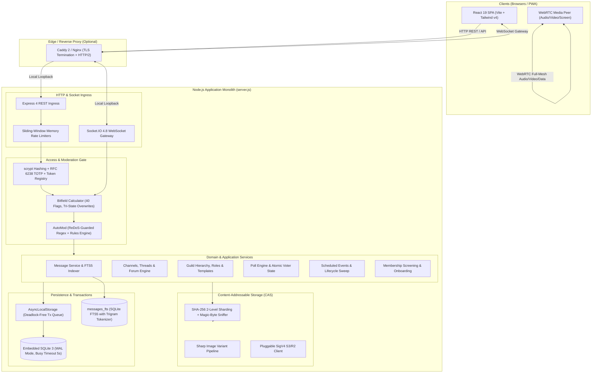

# Antigravity Discord — Monolithic Real-Time Chat Platform

<div align="center">

[](https://nodejs.org/)
[](https://react.dev/)
[](https://tailwindcss.com/)
[](https://www.sqlite.org/)
[](https://socket.io/)
[](https://webrtc.org/)
[]()
[]()
[]()

<p align="center">
  <b>A self-hosted, enterprise-grade chat architecture built strictly against Discord's actual systems model.</b><br/>
  Snowflake IDs • 40-Flag Bitfields • Channel Overwrites • Content-Addressable Storage • WebRTC Mesh • Schema v17<br/>
  <i>Engineered to run as a single, self-contained Node.js process over an embedded SQLite WAL database. Zero external brokers, zero Redis, zero vendor lock-in.</i>
</p>

[System Architecture](#-system-architecture) •
[Key Engineering Highlights](#-key-engineering-highlights) •
[Feature Matrix](#-feature-matrix) •
[Database & Migrations](#-database-schema--migration-pipeline) •
[Quickstart](#-quickstart--local-development) •
[Production Deployment](#-production-deployment) •
[Testing & Verification](#-testing--quality-assurance)

</div>

---

## 🏛️ System Architecture

Antigravity Discord is designed as a **high-cohesion monolithic application**. Instead of distributing complexity across Kafka, Redis, Elasticsearch, and PostgreSQL, the platform consolidates state, streaming, persistence, and media routing into a unified lifecycle:



---

## ⚡ Key Engineering Highlights

### 1. Discord-Accurate 64-Bit Snowflake Identifiers
All primary keys (`users`, `servers`, `channels`, `messages`, `roles`, `attachments`) are **Discord snowflakes** formatted as numeric strings to prevent JavaScript 64-bit float precision loss:
```
 63                                              22 21      17 16      12 11       0
+--------------------------------------------------+----------+----------+----------+
|          Milliseconds since Discord Epoch        | Internal | Internal | Sequence |
|               (1420070400000 / 2015-01-01)       | Worker ID| Proc ID  |  Counter |
+--------------------------------------------------+----------+----------+----------+
```
* **K-Sortable by Default**: Messages and pagination cursors naturally sort in chronological order without secondary index lookups.
* **Leap-Safe Clock Drift Guard**: Millisecond timestamps are monotonically locked to eliminate collision risk across sub-millisecond bursts.

### 2. High-Performance 40-Bit Permission Engine
Access control uses 64-bit integer bitfields evaluated through Discord's exact tri-state cascading resolution hierarchy:
$$\text{Effective} = (\text{Base} \cup \text{Roles} \setminus \text{Role Denies} \cup \text{Role Allows}) \setminus \text{Member Denies} \cup \text{Member Allows}$$
* **Role Hierarchy Invariance**: Users can never assign permissions they do not possess, nor edit/reorder roles ranked equal to or higher than their top role.
* **Unified Access Gate**: Both REST routes and WebSocket gateway handlers pipe requests through `assertChannelAccess()`, guaranteeing that hidden private channels never leak via search, mention autocomplete, or socket rooms.

### 3. Concurrency-Safe SQLite in WAL Mode
Rather than managing multi-node database clusters, the system optimizes a single embedded SQLite instance:
* **Write-Ahead Logging (`PRAGMA journal_mode = WAL`)**: Concurrent readers never block writers, and writes never stall reads.
* **Serialized Transaction Queue with `AsyncLocalStorage`**: Detects nested and concurrent transactions across asynchronous call stacks, preventing lock starvation and dirty rollbacks.
* **Multilingual Trigram FTS5 Indexing**: Standard tokenizers break on unsegmented scripts (Thai, Japanese, Chinese). We compile an FTS5 virtual table using the SQLite `trigram` tokenizer, enabling sub-string and mid-word search across Southeast Asian and CJK languages.

### 4. Content-Addressable Storage (CAS)
Files are stored by the cryptographic hash of their content rather than user-provided filenames:
* **Two-Level Sharding**: Object path `3c/ec/3ceccf3a6b1bd4...png` eliminates single-directory inode bottlenecks.
* **Deduplication & Reference Counting**: Re-uploading the same file across multiple servers references an existing disk block without consuming additional storage.
* **Active Magic-Byte Sniffing**: Inspects raw binary headers (rejects disguised executable files or HTML scripts renamed to `.png`).
* **Signed Private URLs**: Tamper-proof HMAC SHA-256 signed URLs with expiry parameters for private channel assets.

### 5. WebRTC Full-Mesh Media Subsystem
* **Deterministic Perfect Negotiation**: Solves WebRTC glare through polite/impolite peer negotiation.
* **Fixed Tri-Transceiver Architecture**: Microphone, camera, and screen transceivers remain persistently mounted; toggling video swaps tracks in-place without triggering renegotiation cycles.
* **Client-Side Noise Floor Tracking**: Adaptive Voice Activity Detection (VAD) automatically calibrates against ambient room noise.

---

## 🎯 Feature Matrix

| Domain | Implemented Features |
| :--- | :--- |
| **Real-Time Messaging** | • Rich Markdown (Bold, Italics, Codeblocks, Spoilers, Blockquotes)<br/>• Optimistic message dispatch with automatic exponential backoff retry<br/>• Full-Text Search with Trigram tokenization (Works with Thai/CJK)<br/>• Message reactions, replies, pins, edits, deletes, and forward modals<br/>• Voice Notes with recorded waveform visualization and playback rate control<br/>• Mention Inbox (`@everyone`, `@here`, `@role`, `@user`) & unread tracking |
| **Channels & Forums** | • Text, Voice, Announcement, Forum, and Media Channels<br/>• **Forum System (v11)**: Tags with custom emoji, sort orders, gallery layout<br/>• **Channel Following (v13)**: Relay announcement posts to subscriber servers<br/>• Threads (Public/Private), Auto-archive sweeper, participant rosters |
| **Community Engagement** | • **Native Polls (v9)**: Single & multi-choice, live vote counts, voter lists<br/>• **Scheduled Events (v10)**: Server event lifecycle, interested member tracking<br/>• **Soundboard Panel**: Custom sound triggers with cooldown management<br/>• Custom Guild Emoji & Stickers picker with composer integration |
| **Server Onboarding** | • **Membership Screening (v12)**: Mandatory rule agreements before chat access<br/>• **Welcome Screen**: Featured channels directory for new arrivals<br/>• **Onboarding Prompts**: Multi-step role and channel assignment wizards<br/>• **Server Templates (v14)**: Export and clone entire guild structures via template codes |
| **Moderation & Security** | • **AutoMod**: Keyword allow/blocklists, mention quotas, catastrophic ReDoS guard<br/>• Moderation Queue: Member reports, triage actions, kick/ban/unban<br/>• Discord-spec Timeouts: Temporary read-only degradation capped at 28 days<br/>• Comprehensive Audit Log: Traceable records for administrative operations |
| **Identity & Account** | • Argon2/scrypt password hashing with strict salt policies<br/>• RFC 6238 TOTP Two-Factor Authentication with printable backup codes<br/>• Per-account client preferences synced over gateway (v8)<br/>• Profile Privacy Controls (`everyone`, `mutual`, `friends`) & Private User Notes (v10) |
| **Interface & A11y** | • 5 Curated Themes: Dark, Onyx, Light, Ash, and Follow System<br/>• Bilingual localization engine: English & ภาษาไทย (Runtime switchable)<br/>• 0 WCAG Accessibility Violations (Full keyboard traps & screen-reader aria) |

---

## 🗄️ Database Schema & Migration Pipeline

The database schema is defined declaratively in `db/schema.sql` (45 tables) and maintained through a forward-only, transactional migration pipeline in `db.js`.

### Incremental Migration History
```
[v1] Baseline Relational Schema (45 Tables, Foreign Keys Enabled)
 ├── [v2]  Rebuild messages_fts with SQLite trigram tokenizer
 ├── [v3]  Renumber legacy non-snowflake message identifiers
 ├── [v4]  Backfill secure scrypt credentials for seed profiles
 ├── [v5]  Add account_tokens and media duration metadata
 ├── [v6]  Stickers on messages
 ├── [v7]  Guild-scoped user and message report queue
 ├── [v8]  Client settings sync engine (user_settings table)
 ├── [v9]  Native Polls (polls, poll_answers, poll_votes + check rewrite)
 ├── [v10] Scheduled Events, user notes, friend-request notes & profile privacy
 ├── [v11] Forum tags, post pinning, forum layout (List vs Gallery)
 ├── [v12] Membership screening, welcome screen & onboarding prompts
 ├── [v13] Announcement channel following & cross-server relays
 ├── [v14] Server template engine (Full guild cloning snapshots)
 ├── [v15] Bot applications, slash commands & interaction callbacks
 ├── [v16] Raid protection, public widgets & per-server member profiles
 └── [v17] DM calls, spoiler channels, gradient roles & context-menu commands
```

### Relational Entity Graph (Core Entities)
```
users ──────────┬───< guild_members >───┬────────── servers
                │                       │              │
                ├───< messages >────────┤              ├───< channels >
                │        │              │              │        │
                │        ├──< reactions >              │        └──< threads >
                │        ├──< attachments >            │
                │        └──< poll_votes >             ├───< roles >
                │                                      ├───< scheduled_events >
                └───< user_settings >                  └───< server_templates >
```

---

## 🚀 Quickstart & Local Development

### Prerequisites
* **Node.js**: `v20.0.0` or higher (`v22+` recommended)
* **npm**: `v10+`
* Native C++ toolchain (Optional, only if compiling native `sharp` image decoders)

### 1. Clone & Install
```bash
git clone https://github.com/Gubbitkeytoday/discord.git
cd discord
npm ci
```

### 2. Configure Environment
```bash
cp .env.example .env
```
The pre-configured development values in `.env` are ready out of the box.

### 3. Initialize Demo Fixtures (Optional)
Populates 6 interactive test accounts and 3 full community servers:
```bash
npm run seed
```
* **Default Demo Password**: `antigravity123`
* **Pre-seeded Accounts**: `AlexPro` (Owner), `CyberNinja`, `ChillBot`, `GamerGirl99`, `CodeMaster`

### 4. Run Development Stack
Open two terminal windows:

```bash
# Terminal 1: Backend API & WebSocket Gateway (Port 3001)
npm run server

# Terminal 2: Vite React Frontend Client (Port 5173)
npm run dev
```

Visit **`http://localhost:5173`** in your browser.

> [!TIP]
> **Windows 1-Click Launch**: You can simply double-click **`start-discord.bat`**. It will automatically spin up both servers in the background and launch your default browser.

---

## 📦 Production Deployment

Antigravity Discord compiles into a single, self-contained production bundle. The backend can serve both the API and the static React SPA from one process.

### Option A: Monolithic Node Process
```bash
# 1. Build production static bundle into dist/
npm run build

# 2. Start server in production mode
NODE_ENV=production SERVE_STATIC=1 PORT=3001 node server.js
```

### Option B: Docker Compose with Automatic HTTPS (Recommended)
The repository includes a production-ready `docker-compose.yml` integrated with Caddy for automatic Let's Encrypt TLS:

```bash
# 1. Set your public domain in .env
DOMAIN=discord.yourdomain.com

# 2. Launch container stack
docker compose up -d --build
```
Caddy automatically handles HTTPS certificates, HTTP/2 multiplexing, and reverse-proxying WebSocket connections to the Node upstream.

---

## 🛡️ Security Architecture & Hardening

| Threat Vector | Mitigation Strategy |
| :--- | :--- |
| **Credential Compromise** | Passwords hashed using memory-hard `scrypt` with random salt. Sessions stored only as SHA-256 hashes in database. RFC 6238 TOTP two-factor authentication. |
| **Path Traversal Attacks** | Content-addressable storage enforces strict hex-encoded SHA-256 keys. Relative path characters (`..`, `/`, `\`) are stripped and rejected at HTTP ingress. |
| **MIME / File Sniffing** | Storage pipeline sniffs magic bytes directly from binary buffers. Files served with `X-Content-Type-Options: nosniff` and sandboxed `Content-Security-Policy`. |
| **ReDoS (Regex Denial of Service)** | AutoMod regex rules are verified against catastrophic backtracking patterns before storage. Regex execution is wrapped in a bounded execution deadline. |
| **Prototype Pollution** | Strict JSON payload boundaries. Object schemas validated and sanitized against `__proto__` and constructor modifications. |
| **Resource Exhaustion** | In-memory sliding-window rate limiters across read, write, auth, and upload endpoints. File attachment caps enforced per-user and per-category. |

---

## 🧪 Testing & Quality Assurance

The codebase includes an exhaustive test and static analysis pipeline:

```bash
# Run the complete verification battery (JSX + Build + 281 Tests + A11y + i18n)
npm run verify
```

### Individual Quality Commands
| Command | Purpose | Coverage / Metric |
| :--- | :--- | :--- |
| `npm test` | Node test runner integration suite | **281 / 281 tests passing (100%)** |
| `npm run jsx:check` | AST & syntax integrity audit | Verifies tags, imports, component exports |
| `npm run a11y` | Accessibility and ARIA linter | **0 WCAG violations across all components** |
| `npm run i18n:audit` | Dictionary coverage analyzer | 1,288 translation keys synchronized (EN / TH) |
| `npm run storage:verify`| CAS integrity checker | Validates disk files against database metadata |
| `npm run backup` | Live database backup snapshot | Checkpoints WAL and archives assets cleanly |

---

## 📂 Project Directory Structure

```
discord/
├── db/                      # Persistence Layer
│   ├── schema.sql           # Canonical 45-table SQLite DDL schema
│   └── seed.js              # Production-grade mock test fixtures
├── lib/                     # Low-Level Core Libraries
│   ├── permissions.js       # 40-flag bitfield arithmetic engine
│   ├── snowflake.js         # Discord-epoch 64-bit ID generator
│   ├── auth.js              # scrypt password hashing & session management
│   ├── totp.js              # RFC 6238 TOTP two-factor authentication
│   ├── mediaProbe.js        # Magic-byte file sniffer & dimension probe
│   ├── middleware.js        # Prometheus metrics, CSP & request loggers
│   └── config.js            # Environment validation & safety assertions
├── routes/                  # Express REST Route Handlers
│   ├── auth.js              # Authentication, registration & dev login
│   ├── files.js             # Uploads, file delivery & maintenance
│   └── accountSecurity.js   # 2FA enrollment & session revocation
├── services/                # Decoupled Domain Logic
│   ├── access.js            # Unified channel visibility & permission gate
│   ├── automod.js           # Rule engine with ReDoS protection
│   ├── events.js            # Guild scheduled events lifecycle
│   ├── forum.js             # Forum tags, threads & layout ordering
│   ├── onboarding.js        # Rule screening & member onboarding
│   ├── polls.js             # Poll voting, percentages & atomic tallies
│   ├── templates.js         # Guild structure snapshot & clone engine
│   ├── following.js         # Cross-server announcement publisher
│   └── messages.js          # Chat persistence, mentions & FTS5 search
├── src/                     # React 19 Client SPA
│   ├── components/          # Modular UI components (Chat, Voice, Modals)
│   ├── hooks/               # Custom hooks (WebRTC, keybinds, preferences)
│   ├── i18n/                # Internationalization dictionaries (EN, TH)
│   └── utils/               # Markdown parser, permission catalog, audio
├── scripts/                 # Operational Tooling
│   ├── backup.mjs           # Zero-downtime database snapshot tool
│   ├── storage.js           # Garbage collector & storage integrity checker
│   └── test*.mjs            # 242 Integration test suites
├── server.js                # Composition root, gateway & HTTP server
├── storageService.js        # Content-Addressable Storage (CAS) engine
├── realtime.js              # Socket.IO event registry & room dispatch
└── start-discord.bat        # Windows 1-click startup automation
```

---

## 📄 License & Attribution

This project is an independent, unlicensed open-source architectural implementation created for research and educational purposes.  
**Not affiliated with, sponsored by, or endorsed by Discord Inc.** Discord is a registered trademark of Discord Inc.

<div align="center">
  <sub>Built with care by <a href="https://github.com/Gubbitkeytoday">Gubbitkeytoday</a> • Designed for resilient, independent communications.</sub>
</div>
