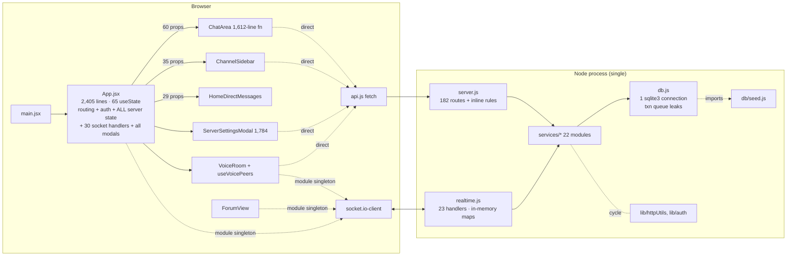
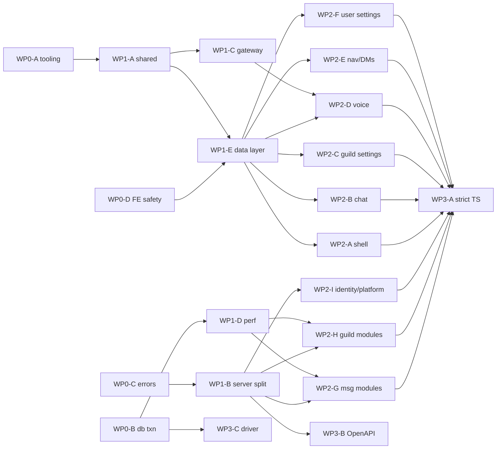

# Architecture & Code-Quality Review — Antigravity Discord

*Principal-engineer review, 2026-09-26. Baseline: `claude/dreamy-goldberg-p3o5ao` @ `7478867`.
Every number below was measured with a script (listed in [Appendix A](#appendix-a--how-the-numbers-were-produced));
every finding cites `file:line` on that commit.*

---

## สรุปภาษาไทย (Thai summary)

**ภาพรวม:** โค้ดเบสนี้ *ทำงานได้จริงและมีวินัยมากกว่าที่ขนาดไฟล์บอก* — backend มี service layer ที่ชัดเจน, SQL เป็น parameterised ทั้งหมด,
มี test แบบ integration 317 เคส ผ่านครบ และ line coverage ฝั่ง backend 85% ส่วนการป้องกัน SSRF / การตรวจสิทธิ์ห้อง socket ก็ทำไว้ดี
**แต่** สถาปัตยกรรมมาถึงเพดานแล้ว: ฝั่ง frontend ทั้งแอปถูกขับด้วย component เดียว (`App.jsx` 2,405 บรรทัด, `useState` 65 ตัว,
ส่ง props ให้ `ChatArea` 60 ตัว) ไม่มี `React.memo`, ไม่มี `lazy()`, ไม่มี Error Boundary, ไม่มี data cache และไม่มี test ฝั่ง client เลย (0%)
ฝั่ง backend `server.js` มี 182 route ในไฟล์เดียว และมี dependency cycle 16 วง

**ปัญหาที่ต้องแก้ก่อน refactor (ความเสี่ยงสูงสุด):**
1. **Transaction รั่ว** — `db.js` ใช้ connection เดียว; คิวเฉพาะ `transaction()` แต่ `runQuery` ทั่วไปจาก request อื่นแทรกเข้าไปใน `BEGIN…COMMIT` ที่เปิดอยู่ได้ ถ้า rollback จะลบงานของคนอื่นทิ้งไปด้วย
2. **การส่งข้อความเป็น N+1 ภายใน transaction** — ทุกข้อความใน guild ที่มีสมาชิก N คน ยิง query ราว 6–9·N ครั้ง ขณะถือ write lock
3. **Presence broadcast ไปทุก socket ในระบบ** (`io.emit`) — O(ผู้ใช้ออนไลน์²) และรั่วสถานะให้คนแปลกหน้า
4. **Reconnect ไม่ sync ข้อความที่พลาด** และ jump-to-message ทำให้ประวัติแหว่ง
5. **Error 500 ส่ง `err.message` ภายในออกไปให้ client**, และ `uncaughtException` ถูกกลืนแล้วรันต่อ
6. **Dependency มีช่องโหว่ 13 รายการ** (critical 1, high 7) — `multer` (runtime, แก้ได้ทันทีแบบไม่ breaking), `sharp`, `qs`

**ทิศทาง Phase 3:** Modular monolith + TypeScript + โฟลเดอร์แบบ feature-sliced, `shared/` เก็บ zod schema / permission bits / socket event map
ที่ใช้ร่วมกันทั้ง client และ server, TanStack Query สำหรับ server state, Zustand สำหรับ UI/session state, OpenAPI สร้างจาก zod แล้ว generate client
ย้ายแบบ **strangler** — ไม่มี big-bang rewrite ทุกขั้นตอน deploy ได้ แผนงานแบ่งเป็น 16 work package ที่ **ระบุไฟล์ที่แต่ละคนเป็นเจ้าของชัดเจน**
เพื่อให้วิศวกรหลายคนทำงานขนานกันได้โดยไม่ชนกัน (ดู [ส่วนที่ 6](#6-migration-plan--parallel-work-packages))

---

## 1. Metrics

### 1.1 Size & shape

| Metric | Value | Comment |
|---|---:|---|
| Backend LOC (server.js, realtime.js, db.js, storageService.js, services/, routes/, lib/) | **15,815** | |
| Frontend LOC (src/, excl. 29 generated locale files) | **23,760** (+3,228 en/th dictionaries) | |
| Test LOC / test cases | 4,424 / **317 (all pass, 11.2 s)** | node:test, black-box HTTP + socket against a spawned server |
| Largest files | `src/App.jsx` 2,482 · `server.js` 2,148 · `ChatArea.jsx` 1,789 · `ServerSettingsModal.jsx` 1,784 · `services/guilds.js` 1,310 · `services/messages.js` 1,303 | 6 files > 1,300 lines |
| Functions scanned | 3,819 | Babel AST |
| Functions > 50 lines / > 100 lines | 160 / **66** | |
| Functions with cyclomatic complexity > 10 / > 20 / > 50 | 160 / 56 / **4** | |
| Worst CC | `ChatArea` **117** (1,612 lines) · `VoiceRoom` 79 · `App` 75 (2,405 lines) · `ChatArea` row renderer `decorated.map` 64 (399 lines) | a single render callback is bigger than most files |
| Worst backend CC | `templates.js:158` txn 47 · `messages.js:333 createMessage` 42 (266 lines) · `messages.js:959 searchMessages` 37 · `guilds.js:442 updateChannel` 33 | |

### 1.2 Frontend state & rendering

| Metric | Value |
|---|---:|
| `useState` calls (whole SPA) / in `App` alone | 382 / **65** |
| `useEffect` / `useMemo` / `useCallback` | 115 / 51 / 53 |
| `React.memo` / `React.lazy` / Error boundaries / `<Suspense>` | **0 / 0 / 0 / 0** |
| Props passed to `<ChatArea>` / inline arrow props in `App` JSX | **60** / 87 |
| Components importing `api.js` directly (no cache layer) | 20 |
| Main JS chunk | **928.7 kB (253.8 kB gzip)**, single chunk; locales are split (good) |
| `eslint-disable` comments with **no ESLint installed** | 23 |
| Tailwind arbitrary values `x-[..]` / inline `style={{}}` / raw hex in JSX | 370 / 35 / 36 |
| Frontend automated tests | **0** |

### 1.3 Backend

| Metric | Value |
|---|---:|
| HTTP routes / in `server.js` | 218 / **182** |
| Routes without `requireUser` in their signature (auth done ad hoc inside, or public) | 49 |
| Socket events client→server / server→client | 23 / 61 (untyped string literals) |
| `await` inside loops (N+1 candidates) | **101** (messages.js 18, guilds.js 13, storageService 12, realtime 10) |
| Backend line / branch / function coverage (V8, via `NODE_V8_COVERAGE` + c8) | **85.1% / 70.7% / 86.1%** |
| HTTP routes never referenced by a test | 30 / 216 (86% touched) |
| Socket events never emitted by a test | **11 / 23** (`edit_message`, `toggle_reaction`, `mark_read`, `update_presence`, `play_sound`, `super_reaction`, `typing_stop`, `leave_channel`, `webrtc_answer`, `webrtc_ice_candidate`, `disconnect`) |
| Circular dependency chains (madge) | **16** (all through `db.js → db/seed.js → lib/auth.js → lib/httpUtils.js → services/applications.js → services/access.js → services/guilds.js → …`) |
| Duplicated code (jscpd, ≥8 lines) | 15 clones / 327 lines (0.83%) — low overall, but the **biggest clone is client↔server** (`services/userSettings.js` ↔ `src/hooks/useUserSettings.js`, 128 lines) |
| Unused exports (knip) | 96 (mostly constants exported "for tests"); 7 unused scripts; 3 unlisted deps (`playwright-core`, `@babel/parser`, `@babel/traverse`) |
| `process.env` reads outside `lib/config.js` | 40 across 11 files |
| Server-side user-facing strings hard-coded in Thai | ~78 lines in 17 files |
| `npm audit` | **13 vulns: 1 critical (tar, via sqlite3→node-gyp), 7 high (multer ×4 advisories, sharp, nanoid, …), 3 moderate (qs/express), 2 low** |
| `npm outdated` (major behind) | express 4→5, vite 6→8, @vitejs/plugin-react 4→6, sqlite3 5→6, sharp 0.33→0.35, lucide-react 0.469→1.x |
| Lint / format / typecheck / CI | **none / none / none / none** (no `.eslintrc`, no Prettier, no `tsconfig`/`jsconfig`, no `.github/workflows`) |

### 1.4 Lowest-covered backend modules (line % / branch %)

`lib/mailer.js` 32.5/57 · `lib/mediaDuration.js` 39.7/74 · `lib/config.js` 64.7/55 · `lib/mediaProbe.js` 64.5/63 · `services/threads.js` 70.2/55 ·
`services/linkEmbeds.js` 72.5/65 · `lib/middleware.js` 73.4/68 · `services/guildAdmin.js` 78.5/76 · `services/users.js` 78.8/79 ·
worst branch coverage: `services/reports.js` **40%**, `services/channelPerms.js` **43%**, `services/applications.js` 52.5%.

---

## 2. What is good (keep it)

Honest credit, because the refactor must not destroy it:

- **Service layer exists and is mostly respected.** Routes in `server.js` are thin wrappers over `services/*` for the majority of endpoints; `services/access.js` is a genuine single choke point for channel authorization.
- **Security fundamentals are above average** — parameterised SQL everywhere, SSRF unfurling pins DNS at connect time (`services/linkEmbeds.js:92`), socket `join_channel` re-checks `VIEW_CHANNEL` (`realtime.js:131`), rooms are re-validated after permission changes (`realtime.js:576`). See `docs/SECURITY-AUDIT.md` for the remaining appsec gaps; this review does not duplicate them.
- **Integration tests are real** — they boot the actual server and drive HTTP + socket. 85% line coverage from black-box tests is a strong safety net for a backend refactor.
- **Idempotent sends** (`nonce`), optimistic pending messages with retry, k-sortable snowflake ids, WAL mode, graceful shutdown, `/api/ready` + `/metrics`.
- **Markdown parse cache** in `ChatArea.jsx:224-240` — someone already found the #1 render hotspot.
- **Locales are code-split** (29 lazy chunks) and the i18n audit is clean (1,511 keys, no missing keys, 0 hard-coded Thai in components).

---

## 3. Ranked findings

Severity: **S1** = correctness/data-loss or production incident risk · **S2** = scale/perf ceiling or security-adjacent · **S3** = maintainability tax that blocks Phase 3 · **S4** = hygiene.

| # | Sev | Area | Finding | Evidence | Fix |
|---|---|---|---|---|---|
| 1 | **S1** | DB | **Transaction isolation leak.** One sqlite3 connection; `transaction()` queues only *other transactions*. Any plain `runQuery/getQuery` from a concurrent request executes on the same connection **inside** the open `BEGIN IMMEDIATE`. If the transaction rolls back, unrelated writes (e.g. a `mark_read`, a presence update) are silently rolled back after they were acked; concurrent readers see uncommitted rows. The comment at `db.js:449-460` describes the problem for nested/concurrent transactions only. | `db.js:412` (single conn, `serialize()`), `db.js:416-438` (unqueued helpers), `db.js:466-487` (queue only in `transaction`) | Short term: route **every** statement through the same promise queue when no ALS context is active (writes wait for open txn; reads either wait or use a 2nd read-only connection). Long term: `better-sqlite3` (synchronous, real transactions, 5–10× faster) or `node:sqlite`, with a repository layer. Add a regression test: txn that throws after a concurrent `mark_read`. |
| 2 | **S1** | Perf/DB | **Message send is O(members) sequential queries inside the write transaction.** `bumpUnreadCounters` loops the whole guild: per member `canInChannel` (→ `assertChannelAccess` → `resolvePermissions`, ~5 queries), `INSERT…ON CONFLICT` read_state, 2 mute lookups, optional role lookup, notification insert. ≈6–9 × N queries per message, holding the only write lock. A 500-member guild ≈ 4,000 queries per message. | `services/messages.js:468` (txn opens) → `:583` → `:607-700`; `services/access.js:24-81`; `services/guilds.js` `resolvePermissions` (5 queries) | Compute channel visibility **once per role-set**, not per member: load overwrites + roles for the channel once, derive the visible member set in memory; batch `INSERT … SELECT` for read_states; one query for mutes (`IN (…)`). Move notification fan-out **after** commit. Target: O(1) queries per message + O(mentions). |
| 3 | **S1** | Realtime | **Reconnect does not backfill.** On `connect` the client re-identifies and re-joins rooms, but never refetches messages/read-states for the open channel; anything sent during a network blip is lost until the user switches channel. | `src/App.jsx:353-363`, `:327-350` | On `identified` after a reconnect: refetch `?after=<last id>` for the active channel, refetch read-states. With TanStack Query this is `queryClient.invalidateQueries()` on reconnect. |
| 4 | **S1** | Frontend | **No error boundary anywhere.** Any render exception (malformed embed, unexpected null in a 400-line row renderer) blanks the whole app. | `src/main.jsx:32-38`; grep: 0 `componentDidCatch`/`ErrorBoundary` | Root boundary + per-feature boundaries (message row, settings tab, voice). Report to `/api/client-errors`. |
| 5 | **S1** | Backend | **500s leak internal messages; process continues after `uncaughtException`.** `errorHandler` returns `err.message` for every status incl. SQLite errors; socket handlers ack `err.message` raw. `uncaughtException` is logged and swallowed — the process keeps serving in an unknown state. | `lib/httpUtils.js:92-103`; `realtime.js:175-181` et al.; `server.js:71-77` | Map non-`ApiError` to `{error:'Internal error', code:'INTERNAL'}` + request id. On `uncaughtException`: log, start graceful shutdown, exit non-zero (let the orchestrator restart). |
| 6 | **S1** | Deps | **13 known vulns.** `multer ≤2.2.0` has 4 high DoS/limit-bypass advisories on the upload path — fix is a non-breaking bump to 2.4.0. `sharp` (libvips/libheif CVEs) processes untrusted images. `qs` DoS via express 4.22.2. Critical `tar` is build-time only (sqlite3→node-gyp). | `npm audit`; `package.json:45` (`multer ^2.2.0`), `:38` sharp | Today: `npm audit fix` (multer, qs, nanoid). This sprint: sharp 0.35 (test `lib/mediaProbe.js`). With #1: replace `sqlite3` (drops the node-gyp/tar chain). |
| 7 | **S2** | Realtime | **Presence and profile updates are broadcast to every connected socket on the instance.** O(online²) traffic on every connect/disconnect wave, and strangers learn each other's online status/profile changes. | `realtime.js:113`, `:551`, `:271`; `server.js:301`, `:314` | Emit to the union of rooms that should know: the user's guild rooms + friends' `user-*` rooms + open DM rooms. Precompute a "presence audience" per user on identify. |
| 8 | **S2** | Realtime | **Channel lifecycle fan-out does a permission query per socket.** `emitToChannelViewers` runs `canInChannel` for each socket in the guild room (cached per user, but still one `resolvePermissions` per member); `revalidateRooms` similar. | `realtime.js:629-645`, `:576-620` | Same visibility-by-role-set computation as #2; expose `visibleMembers(channelId)` once from `services/access.js` and reuse. |
| 9 | **S2** | Scale | **Horizontal scaling is structurally blocked** (and that is OK — but it must be a decision, not an accident). SQLite file, in-memory rate limit buckets, typing/sound/AFK maps, `socketsByUser`, `remindedEvents`, and **`resetVolatileState` deletes every `voice_states` row at boot** (a second instance would wipe the first's voice rooms). No Socket.IO adapter. | `lib/rateLimit.js:11`; `realtime.js:24-39`, `:814-821`; `server.js:2074` | Declare "single-node, vertical scale" as the supported topology for self-host. Put every piece of in-memory state behind a small interface (`RateLimitStore`, `EphemeralStore`, `PubSub`) with an in-memory impl now, so Redis + Postgres are a swap later, not a rewrite. |
| 10 | **S2** | Frontend | **Re-render storm.** All server state lives in `App` (65 `useState`). Every typing event, presence change, reaction, or keystroke-driven state re-renders `App` → `ChatArea` (60 props, 16 new inline functions per render) → the 399-line inline row renderer for every message. Zero `React.memo`. The composer's `inputText` lives in the same component as the list, so **each keystroke reconciles the entire message list**. | `src/App.jsx:77-200`, `:1786-1870`; `src/components/ChatArea.jsx:108`, `:915-1314` | Split `MessageList` / `MessageRow` (memoized, keyed by id + version) / `Composer` (owns its own text state). Move typing/presence into a Zustand store with selectors so only subscribers update. Virtualize the list (`@tanstack/react-virtual`). |
| 11 | **S2** | Frontend | **Socket listener churn on every render.** `onSuperReactionEvent` is an inline closure prop; `ChatArea`'s effect depends on it, so every `App` render unsubscribes + resubscribes `super_reaction`. Same pattern risk for other inline props used in effects. | `src/App.jsx:1836-1843` → `src/components/ChatArea.jsx:301-304` | A typed `useSocketEvent(event, handler)` hook that stores the handler in a ref and subscribes once. |
| 12 | **S2** | Frontend | **Message history model is a single array with no windows.** After jump-to-message (`around=`), new live messages are appended to a non-contiguous page (visible gap), and there is no forward paging (`after=` is supported by the API but never used). The array grows unbounded on scroll-back. | `src/App.jsx:461-520`, `:595-607`, `:556-569`; `server.js:683` (`after` exists) | `useInfiniteQuery` with bidirectional pages keyed by channel; live messages only append when the newest page is loaded; cap retained pages. |
| 13 | **S2** | Backend | **Search post-filters after `LIMIT`.** Rows are limited to `cap`, then filtered by `canInChannel`; a busy private channel can push every visible hit out of the page, and result counts are wrong. Also N+1 name lookups for `from:`/`in:` filters and per-row read-state visibility checks. | `services/messages.js:1096-1112`, `:983-994`, `:1012-1019`, `:1199-1206` | Push visibility into SQL (`channel_id IN (<visible channel ids>)` computed once per viewer per server); batch name resolution with `IN (…)`. |
| 14 | **S2** | Security-adjacent | **Four different authorization idioms** — `requireUser` middleware, `assertSelf(req, :userId)`, `assertPermission({userId: req.userId})` that is relied on to reject `null`, `requireAdmin`. 49 routes do not declare auth in their signature; several routes still carry a redundant `:userId` path param (`/api/initial-data/:userId`, `/api/dms/:userId`, `/api/read-states/:userId`, `/api/notifications/:userId`), an IDOR-shaped API that only works because of per-route checks. Automod PATCH/DELETE lack `writeRateLimit` and emit no event while POST does. | `server.js:289-330`, `:462`, `:635`, `:882`, `:911`, `:1747-1781` | One declarative route definition: `{ auth: 'user'|'bot'|'public'|'admin', permission?, rateLimit, body: zodSchema }`. Replace `/:userId` self-routes with `/@me`. Lint rule: no route without an `auth` key. |
| 15 | **S3** | Frontend | **God component.** `App` is 2,405 lines, CC 75, holds routing (hand-rolled `parseLocation`), auth, all server state, all socket handlers (one 335-line effect with 30+ handlers and an `eslint-disable` for deps), every modal flag, and all mutations. | `src/App.jsx:77`, `:583-917`, `:553` | See target architecture: app shell + router + providers; feature slices own their queries, socket subscriptions and modals. |
| 16 | **S3** | Backend | **`server.js` is a 2,148-line route file** (182 routes) with business rules inlined (e.g. discoverable-join policy, report scoping, interaction callbacks) and direct SQL (19 calls). | `server.js:422-447`, `:1356-1395`, `:1856`, `:1874-1920` | Strangler split into `routes/<domain>.js` (mechanical, one PR), then move inline rules into services. |
| 17 | **S3** | Cross-cutting | **Client↔server duplication with no shared source of truth.** User-settings defaults/validation duplicated (128 lines); permission bit table hand-mirrored; schema version hard-coded in the client; 84 socket event names as string literals on both sides. | jscpd: `services/userSettings.js:20-146` ↔ `src/hooks/useUserSettings.js:21-135`; `src/utils/permissionCatalog.js:8-44` ↔ `lib/permissions.js:6-42`; `src/App.jsx:60` ↔ `db.js:395` | `shared/` package (TS): `permissions.ts`, `settings.ts`, `schemas/*.ts` (zod), `events.ts` (typed socket map), `version.ts`. |
| 18 | **S3** | Backend | **Validation is ad hoc per service**; socket payloads are destructured unvalidated (`async ({ messageId, content }, ack)` throws on `undefined` before the `try`, becoming an unhandled rejection; a non-function `ack` crashes the handler). | `realtime.js:184`, `:196`, `:208`, `:285`, `:353`; ~27 hand-rolled `typeof`/length checks across services | zod schemas in `shared/schemas`; one `validate(schema)` middleware and one `onEvent(schema, handler)` socket wrapper that also normalizes ack. |
| 19 | **S3** | Backend | **16 circular import chains** rooted in `db.js` importing `db/seed.js`, and `lib/httpUtils.js` importing `services/applications.js` (dynamically, per request, to dodge the cycle). | madge; `lib/httpUtils.js:33`, `:42` | `db.js` must not import seed; auth/identify middleware moves to `server/http/middleware/identify.ts` and receives `resolveBotToken` by injection. |
| 20 | **S3** | Error model | **Mixed-language error surface.** ~78 server lines return Thai strings, the rest English; the client toasts `err.message` directly, so users see Thai errors in a German UI. Some services throw bare `Error` (11). | `services/access.js:69-73`; `lib/httpUtils.js:62`; `realtime.js:163`; `services/linkEmbeds.js:28-48` | Server returns stable `code` + `details`; client maps `code` → i18n key (`errors.<CODE>`). Messages become developer-facing English. |
| 21 | **S3** | Tooling | **No ESLint, Prettier, typecheck or CI** — yet 23 `eslint-disable react-hooks/exhaustive-deps` comments suggest people believe a linter is running. `npm run verify` exists but nothing enforces it. | repo root; `package.json` scripts | Add flat-config ESLint (react-hooks, import/no-cycle), Prettier, `tsc --noEmit` with `checkJs`, GitHub Actions running `verify`. |
| 22 | **S3** | Frontend data | **No data layer.** 20 components call `api.js` directly with bespoke loading/error state; no request dedupe, no cache, no invalidation; stale-response guards are hand-written (`stale` flags, `activeChannelIdRef` checks). Upload bypasses the wrapper (no Bearer header, no `ApiRequestError`). | `src/App.jsx:452`, `:487-528`, `:561-566`; `src/components/ChatArea.jsx:345-350` | TanStack Query; a single typed client generated from OpenAPI; upload via the same client. |
| 23 | **S3** | Frontend | **Bundle: one 929 kB chunk, zero code-splitting.** Settings modals (ServerSettings 1.8k lines, UserSettings + 18 tabs), voice/WebRTC, forum, events, polls are all eagerly loaded. | `vite build` output; `src/App.jsx:5-36` (all static imports) | `lazy()` per modal/feature route; target < 350 kB initial (gzip < 110 kB). |
| 24 | **S4** | Frontend | Side effect inside a state updater (network fetch in `setDmChannels(prev => …)`; runs twice under StrictMode). | `src/App.jsx:634-640` | Decide outside the updater; with Query: `invalidateQueries(['dms'])`. |
| 25 | **S4** | Backend | Config: 40 `process.env` reads outside `lib/config.js`; logging is `console.*` with emoji (48 sites), no request id / structured fields outside `requestLogger`. | `lib/mailer.js`, `lib/s3Client.js`, `db.js`, `server.js` … | All env through `config` (zod-validated); `pino` with child loggers carrying `reqId`/`userId`/`socketId`. |
| 26 | **S4** | CSS | Tailwind consistency is decent (31 `d-*` tokens) but 370 arbitrary values, 36 raw hex colours and 35 inline styles bypass the tokens; light/dark theming is done by `scripts/themeify*.mjs` rewrites (unused per knip). | grep counts; `src/index.css` | Define spacing/size tokens in `@theme`, lint arbitrary values (`eslint-plugin-tailwindcss` or a grep gate). |
| 27 | **S4** | Dead code | 96 unused exports, 7 unused scripts, 3 unlisted deps. | knip output | Clean up in WP0-A once lint exists; add `knip` to CI in warn mode. |

**Accessibility structure** is in good shape by static audit (`npm run a11y`: 349 buttons, 149 controls, no issues) — the remaining risk is the message list: without virtualization or `aria-live` batching a screen reader user in a busy channel gets flooded. Keep `role="log"` semantics when virtualizing.

---

## 4. Current architecture (as-is)



## 5. Target architecture (Phase 3)

Principles: **modular monolith**, single deployable, TypeScript everywhere, **one contract package** shared by client and server, feature-sliced frontend,
server state in TanStack Query, client/UI state in Zustand, every boundary (HTTP body, socket payload, env) parsed by zod.

### 5.1 Folder structure

```
shared/                         # TS, no runtime deps except zod — imported by both sides
  permissions.ts                # bit table + compute helpers (from lib/permissions.js)
  settings.ts                   # user-settings defaults + schema (kills the 128-line clone)
  schemas/                      # zod: user, guild, channel, message, poll, event, ...
  api/routes.ts                 # route registry: method, path, auth, params/body/response schemas
  realtime/events.ts            # ClientToServerEvents / ServerToClientEvents maps + payload schemas
  errors.ts                     # error codes enum (client maps code -> i18n key)
  version.ts                    # SCHEMA_VERSION / API_VERSION

server/
  main.ts                       # composition root (what server.js claims to be today)
  config.ts                     # zod-validated env, the only process.env reader
  http/
    router.ts                   # builds Express routes from shared/api/routes.ts + handlers
    middleware/{identify,auth,rateLimit,validate,errors}.ts
    openapi.ts                  # generated from the registry (zod-to-openapi)
  realtime/
    gateway.ts                  # io setup, identify, typed onEvent(schema, handler)
    audiences.ts                # presence / channel-viewer audience computation (batched)
    handlers/{messages,voice,presence,typing,webrtc}.ts
  modules/                      # one folder per bounded context
    messages/{routes,service,repo}.ts
    guilds/  channels/  members/  roles/  dms/  voice/  threads/  forum/  polls/
    events/  onboarding/  automod/  webhooks/  applications/  reports/  files/  auth/  users/
  platform/
    db/{connection,tx,migrations/}.ts   # better-sqlite3 (or node:sqlite); Postgres-ready repo seam
    ephemeral/{store,memory}.ts          # rate limits, typing, AFK — Redis impl later
    pubsub/{bus,memory}.ts               # io adapter seam
    log.ts                               # pino

src/  (client)
  app/            # AppShell, providers (QueryClient, I18n, Theme), router, ErrorBoundary
  shared/         # ui primitives, hooks (useSocketEvent), lib (apiClient generated), i18n
  entities/       # message, user, channel, guild: types, selectors, small presentational pieces
  features/
    chat/         # MessageList (virtualized), MessageRow (memo), Composer, attachments, pins
    channels/     # ChannelSidebar, channel settings, threads
    guild-settings/   # ServerSettingsModal + tabs (lazy)
    user-settings/    # UserSettingsModal + tabs (lazy)
    dms/  voice/  forum/  events/  polls/  search/  notifications/  auth/
  stores/         # Zustand: session, ui (modals, panels), presence, typing, voice
  realtime/       # socket client + bridge: server events -> queryClient.setQueryData / stores
```

### 5.2 Target diagram

```mermaid
flowchart TB
  subgraph shared["shared/ (TypeScript, zod)"]
    S1[schemas/*]:::c
    S2[api/routes.ts registry]:::c
    S3[realtime/events.ts]:::c
    S4[permissions.ts · settings.ts · errors.ts]:::c
  end

  subgraph client["src/ — React 19 SPA"]
    direction TB
    shell[app/ AppShell · Router · ErrorBoundary · Providers]
    feats["features/* (lazy per route/modal)<br/>chat · channels · dms · voice · guild-settings · user-settings · forum · events"]
    ent[entities/*]
    q[(TanStack Query cache<br/>server state)]
    z[(Zustand stores<br/>session · ui · presence · typing · voice)]
    apic[apiClient — generated from OpenAPI]
    bridge[realtime bridge<br/>typed socket → setQueryData / store]
    shell --> feats --> ent
    feats --> q & z
    q --> apic
    bridge --> q & z
  end

  subgraph server["server/ — modular monolith"]
    direction TB
    http[http/router · middleware: identify → auth → rateLimit → validate]
    gw[realtime/gateway · onEvent(schema) · audiences]
    mods["modules/* service + repo<br/>messages · guilds · channels · voice · ..."]
    acc[access: permission engine<br/>batched · per-request cache]
    plat["platform: db(tx) · ephemeral store · pubsub · log · config"]
    http --> mods
    gw --> mods
    mods --> acc --> plat
    mods --> plat
    oa[openapi.ts]
  end

  S2 --> http
  S2 --> oa --> apic
  S3 --> gw
  S3 --> bridge
  S1 --> http & gw & apic
  S4 --> acc & feats
  apic -->|HTTPS JSON| http
  bridge <-->|Socket.IO typed| gw
  plat --> DB[(SQLite WAL → Postgres optional)]
  plat -.later.-> R[(Redis: adapter + rate limits)]
  classDef c fill:#eef,stroke:#88f
```

### 5.3 Key design decisions

1. **Contract-first, code-generated both ways.** `shared/api/routes.ts` is a registry of `{method, path, auth, permission?, params, query, body, response}` zod schemas. The server router is *built from it* (so a route cannot exist without a schema and an `auth` declaration — closes #14/#18), OpenAPI is emitted from it, and the client uses either the registry directly (typed `api.call('messages.list', {...})`) or an `openapi-typescript`-generated client. Pick the registry-direct approach first (no codegen step), keep OpenAPI for bots/3rd-party docs.
2. **Typed sockets.** `shared/realtime/events.ts` exports `ServerToClientEvents` / `ClientToServerEvents` for `socket.io`'s generics plus zod payload schemas. Server handlers are registered via `onEvent('send_message', schema, handler)` which validates, normalizes `ack`, rate-limits and maps errors to codes.
3. **Server state = TanStack Query, never Zustand.** Messages (`useInfiniteQuery`, bidirectional), guild detail, members, roles, DMs, read-states. The realtime bridge writes socket events into the cache (`setQueryData`) — the only place that knows event→cache mapping. On reconnect: `invalidateQueries()` for active queries (fixes #3).
4. **Zustand only for client state** with selector subscriptions: session, open modals/panels, typing, presence overlay, voice session. This is what removes the re-render storm (#10).
5. **Permission engine batched.** `access.visibleMembers(channelId)` and `access.visibleChannels(userId, serverId)` computed from roles+overwrites in memory, cached per request / per event (fixes #2, #8, #13). The same pure functions live in `shared/permissions.ts` so the client can compute UI affordances from the same code.
6. **DB access through a repo + `tx()`** on a synchronous driver (`better-sqlite3`), which makes #1 impossible by construction (a sync transaction cannot interleave). Postgres remains an option behind the repo seam, not a Phase 3 goal.
7. **Single node is the supported topology** for self-hosting; in-memory state sits behind `platform/ephemeral` + `platform/pubsub` so a Redis impl is additive.

---

## 6. Migration plan — parallel work packages

Strangler rules, applying to every WP:
- **Every PR ships.** `npm run verify` green (lint + typecheck + build + 317 tests) at every merge. No long-lived branches > 3 days.
- **Old and new coexist.** New code goes into `shared/`, `server/`, `src/app|features|stores|realtime/`. Old files shrink until deleted; a file is deleted only by its owner.
- **TypeScript is incremental**: `allowJs` + `checkJs: false` globally, `strict` for `shared/**`, `server/**`, `src/{app,features,stores,realtime,shared}/**`. Converting a legacy `.js` to `.ts` is done by its owner only.
- **Ownership = exclusive write access** for the files listed. Anyone needing a change in someone else's file opens a small PR to the owner or asks in the WP channel. Shared hotspots (`package.json`, `package-lock.json`, `vite.config.js`, `src/App.jsx`, `server.js`) each have exactly one owner per phase.

### Phase 0 — Stop the bleeding (week 1, all 4 WPs in parallel)

| WP | Goal | Exclusive file ownership | Done when |
|---|---|---|---|
| **WP0-A Platform & tooling** | ESLint flat config (react-hooks, import/no-cycle warn), Prettier, `tsconfig.json` (allowJs), GitHub Actions running `verify` + `npm audit --omit=dev --audit-level=high`; `npm audit fix` (multer 2.4, qs, nanoid); sharp 0.35; add missing devDeps (`@babel/parser`, `@babel/traverse`, `playwright-core`); remove unused scripts (knip). | `package.json`, `package-lock.json`, `eslint.config.js`, `.prettierrc`, `tsconfig*.json`, `.github/**`, `scripts/themeify*.mjs`, `scripts/i18n-remaining.mjs`, `vite.config.js` | CI green; audit shows 0 high at runtime; lint runs (warnings allowed, errors 0). |
| **WP0-B DB correctness** | Fix #1: queue every statement behind the open transaction (or 2nd read-only connection); regression test for rollback isolation; stop `db.js` importing `db/seed.js` (seed via script only) — breaks the root of all 16 cycles. | `db.js`, `db/seed.js`, `db/schema.sql`, new `scripts/test-db.mjs` | New test proves a concurrent write survives a sibling rollback; madge cycles ≤ 8. |
| **WP0-C Error model & process safety** | Fix #5: mask 5xx messages, add request id; `uncaughtException` → graceful exit; `identify` middleware takes injected deps (removes dynamic imports, #19); error `code` catalogue started in `lib/errors.js` (becomes `shared/errors.ts`). | `lib/httpUtils.js`, `lib/middleware.js`, new `lib/errors.js`; **`server.js:66-80` block only** (coordinated one-time edit with WP1-B owner, landed first) | 5xx body never contains SQL; kill test shows exit + restart. |
| **WP0-D Frontend safety net** | Fix #4: `src/app/ErrorBoundary.jsx` at root + around ChatArea/Settings/Voice; fix #3 (reconnect refetch of active channel + read-states) and #11 (`useSocketEvent` hook); move socket singleton to `src/realtime/socket.js`. Add Vitest + React Testing Library with 3 smoke tests. | `src/main.jsx`, new `src/app/**`, new `src/realtime/**`, `src/components/ChatArea.jsx` **lines 295-306 only** (super-reaction effect) — coordinate with WP2-B; `src/App.jsx` **reconnect effects 318-363 only** — coordinate with WP2-A; `vitest.config.js` | Throwing in a row shows fallback not blank page; offline→online shows missed messages. |

### Phase 1 — Seams and contracts (weeks 2–4, 5 WPs in parallel)

| WP | Goal | Exclusive file ownership | Depends on |
|---|---|---|---|
| **WP1-A `shared/` contract** | Create `shared/` (TS, strict): `permissions.ts` (from `lib/permissions.js` — old file re-exports), `settings.ts` (dedupe #17), `errors.ts`, `version.ts`, `realtime/events.ts` (all 84 events typed), `schemas/*` for the top 30 routes by traffic (messages, channels, guilds, members, dms, read-states, auth). | `shared/**`, `lib/permissions.js`, `src/utils/permissionCatalog.js`, `services/userSettings.js`, `src/hooks/useUserSettings.js` | WP0-A (tsconfig) |
| **WP1-B `server.js` strangler split** | Mechanical move of the 182 routes into `server/http/routes/<domain>.js` (≈18 files) with **zero behavior change**; `server.js` becomes the composition root (< 250 lines). Then introduce `defineRoute({auth, permission, rateLimit, body})` and migrate route files one by one (fixes #14). Replace `/:userId` self routes with `/@me` aliases (keep old paths for one release). | `server.js`, `server/http/**`, `routes/*.js` (moved under `server/http/routes/`) | WP0-C landed |
| **WP1-C Realtime gateway** | Split `realtime.js` into `server/realtime/{gateway,audiences,handlers/*}`; typed `onEvent(schema, handler)` wrapper with ack normalization (#18); scoped presence audience (#7); tests for the 11 untested socket events. | `realtime.js`, `server/realtime/**`, new `scripts/test-realtime.mjs` | WP1-A `events.ts` (can start with a local copy, switch on merge) |
| **WP1-D Permission & fan-out performance** | Batched permission engine: `visibleMembers(channelId)`, `visibleChannels(userId, serverId)`, per-request memo; rewrite `bumpUnreadCounters` to set-based SQL and move notifications after commit (#2); search visibility in SQL (#13); read-state visibility batched. Benchmark script: send latency at 50/500/2,000 members. | `services/access.js`, `services/messages.js`, `services/guilds.js` (`resolvePermissions` + read paths), `services/channelPerms.js`, new `scripts/bench/*.mjs` | WP0-B |
| **WP1-E Client data layer** | Add TanStack Query + Zustand; typed `apiClient` over `shared/api/routes.ts` (or `openapi-typescript`); realtime bridge that maps typed server events → `setQueryData`; migrate `src/api.js` callers to the client *inside `src/shared/lib`* without touching feature files yet (adapter keeps `get/post` signatures). Upload goes through the same client (#22). | `src/api.js`, new `src/shared/lib/**`, `src/realtime/bridge.js`, `src/stores/**` | WP1-A (schemas), WP0-D (socket module) |

### Phase 2 — Strangle the frontend by feature (weeks 4–8, 6 WPs in parallel)

Rule for Phase 2: **feature WPs build their slice behind the existing props contract first** (the new `features/chat/ChatArea` accepts the same 60 props), so `App.jsx` swaps an import and nothing else. Only WP2-A edits `App.jsx`; it then removes props one by one as features switch to Query/Zustand hooks.

| WP | Goal | Exclusive file ownership |
|---|---|---|
| **WP2-A App shell & state extraction** | Replace `parseLocation` with a router (TanStack Router or React Router data APIs); move session/ui/typing/presence/voice-session state into Zustand stores; delete the 335-line socket effect as WP1-E's bridge covers each event; `lazy()` every modal/feature (#23). Target: `App.jsx` → `src/app/AppShell.tsx` < 300 lines. | `src/App.jsx`, `src/app/**` (after WP0-D hands over), `src/stores/session*`, `src/stores/ui*`, `src/components/{ConfirmModal,InputModal,ToastStack,QuickSwitcher,ContextMenu}.jsx` |
| **WP2-B Chat feature** | `features/chat`: `MessageList` (virtualized, `useInfiniteQuery` bidirectional — fixes #12), memoized `MessageRow` (split the 399-line renderer into Row/Header/Content/Attachments/Reactions/Embeds), `Composer` with local state, attachments, pins popover, search panel. | `src/components/ChatArea.jsx`, `MessageContextMenu.jsx`, `ComposerAutocomplete.jsx`, `EmojiPicker.jsx`, `StickerPicker.jsx`, `PinnedMessagesPopover.jsx`, `RichEmbed.jsx`, `LinkEmbed.jsx`, `PollCard.jsx`, `CreatePollModal.jsx`, `VoiceNote.jsx`, `SuperReaction.jsx`, `ImageLightboxModal.jsx`, `EditHistoryModal.jsx`, `ForwardMessageModal.jsx`, `SearchResultsPanel.jsx`, `src/utils/{markdownParser.jsx,messageGrouping.js,slashCommands.js}`, `src/features/chat/**` |
| **WP2-C Guild settings** | `features/guild-settings` (lazy): split `ServerSettingsModal` (52 `useState`) into tab routes, each using query/mutation hooks + one form lib (react-hook-form + zod resolver from `shared/schemas`). | `src/components/ServerSettingsModal.jsx`, `ChannelSettingsModal.jsx`, `settings/{AutoModTab,WebhooksTab,ChannelPermissionsTab,OnboardingTab,InsightsTab,ApplicationsTab}.jsx`, `settings/primitives.jsx`, `src/features/guild-settings/**` |
| **WP2-D Voice & calls** | `features/voice`: `VoiceRoom` (CC 79) split into stage/grid/controls; `useVoicePeers`/`useVoiceMedia` into a voice store + WebRTC service with explicit lifecycle; typed signalling events. | `src/components/{VoiceRoom,CallPanel,SoundboardPanel}.jsx`, `src/hooks/{useVoicePeers,useVoiceMedia,useVoiceSettings}.js`, `settings/VoiceSettings.jsx`, `src/utils/{speech,voiceNote,soundEffects}.js`, `src/features/voice/**`, `src/stores/voice*` |
| **WP2-E Navigation, DMs, members** | `features/{channels,dms,members,notifications}`: ChannelSidebar, ServerRail, HomeDirectMessages, MemberList, context menus, inbox, invites — all on queries + presence store selectors. | `src/components/{ChannelSidebar,ServerRail,ServerDropdown,HomeDirectMessages,MemberList,MemberContextMenu,UserProfileModal,UserStatusMenu,NotificationsInbox,NotificationSettingsPopover,CreateGroupDmModal,CreateChannelModal,CreateServerModal,InviteJoinScreen,ChannelGate,FollowChannelModal,OnboardingModal}.jsx`, `src/features/{channels,dms,members,notifications}/**`, `src/stores/presence*` |
| **WP2-F User settings, auth, forum, events** | `features/{user-settings,auth,forum,events}` (all lazy). | `src/components/{UserSettingsModal,LoginScreen,ForumView,EventsPanel}.jsx`, `settings/{AccessibilityTab,AccountSecurityTab,ActivityTab,AppearanceTab,ChatTab,KeybindsTab,NotificationsTab,PrivacyTab,ProfileTab,StreamerModeTab}.jsx`, `src/hooks/{useKeybinds,useFocusTrap}.js`, `src/features/{user-settings,auth,forum,events}/**` |

Backend Phase 2 runs concurrently with the frontend WPs (different files):

| WP | Goal | Exclusive file ownership |
|---|---|---|
| **WP2-G Modules: messaging core** | Move `services/{messages,threads,forum,polls,reports}` into `server/modules/*` as `service.ts` + `repo.ts`; zod-validated inputs; convert to TS. | those services, `server/modules/{messages,threads,forum,polls,reports}/**` |
| **WP2-H Modules: guild core** | Same for `services/{guilds,guildAdmin,channelPerms,onboarding,templates,insights,events,following}`; split `guilds.js` (1,310 lines) into guilds/channels/members/roles/invites. | those services, `server/modules/{guilds,channels,members,roles,invites,onboarding,templates,insights,events,following}/**` |
| **WP2-I Modules: identity & platform** | `services/{users,userSettings,accountSecurity,dataRights,applications,webhooks,automod,calls,linkEmbeds}`, `lib/{auth,config,mailer,rateLimit,s3Client,totp}`, `storageService.js` → `server/modules|platform`; `platform/ephemeral` + `platform/pubsub` seams (#9); pino logging (#25); all env through `config.ts`. Tests for mailer/config/mediaDuration (lowest coverage). | those files, `server/platform/**`, `server/modules/{users,auth,applications,webhooks,automod,calls,files}/**` |

Note: WP1-D owns `services/{access,messages,guilds,channelPerms}.js` until its perf work merges; WP2-G/H pick them up only after WP1-D closes (explicit hand-over).

### Phase 3 — Finish the conversion (weeks 8–10)

| WP | Goal | Ownership |
|---|---|---|
| **WP3-A Strict TS everywhere** | Flip `checkJs`/`strict` repo-wide; delete remaining `.js`; `noUncheckedIndexedAccess` in `shared/`. | each file's Phase 2 owner converts their own files; WP0-A owns the final `tsconfig` flip |
| **WP3-B OpenAPI & bot SDK** | Emit `openapi.json` from the registry in CI; publish docs page; regenerate `scripts/example-bot.mjs` against it. | `server/http/openapi.ts`, `docs/api/**`, `scripts/example-bot.mjs` |
| **WP3-C DB driver swap** | `better-sqlite3` (or `node:sqlite`) behind `platform/db`; drops sqlite3 → node-gyp → tar vulnerability chain; migrations runner kept. | `server/platform/db/**`, `db.js` (deleted at end) |

### Dependency graph of the work packages



### What to do first (risk reduction per engineer-day)

1. **Day 1:** `npm audit fix` (multer high ×4 on the upload path) — WP0-A.
2. **Days 1–3:** transaction isolation fix + regression test — WP0-B (#1: silent data loss).
3. **Days 1–3:** 5xx masking + crash-exit — WP0-C (#5).
4. **Days 2–4:** error boundary + reconnect backfill — WP0-D (#3, #4: the two user-visible "app is broken" failures).
5. **Week 2:** send-path N+1 and presence broadcast — WP1-D / WP1-C (#2, #7: the first things to fall over as a server grows).
6. **Week 2+:** CI + lint gates *before* the big moves, so the strangler split cannot regress silently.
7. Only then the large structural work (server split, shared contract, frontend slices).

### Guardrails that keep it shippable

- Contract tests: each `shared/api/routes.ts` entry gets a response-schema assertion in the existing integration suite (reuse the 317 tests; add `schema.parse(res.body)`).
- Performance budgets in CI: initial JS ≤ 350 kB; `bench/send-message` p95 at 500 members ≤ 30 ms.
- Coverage floor: backend lines ≥ 85% (current), frontend ≥ 40% by end of Phase 2 (from 0%).
- Cycle gate: `madge --circular` must not increase; target 0 by end of Phase 1.

---

## Appendix A — how the numbers were produced

All commands run from the repo root after `npm ci` on Node 22.

| Metric | Command |
|---|---|
| LOC / file sizes | `wc -l` over the listed paths |
| Function length, cyclomatic complexity, hook counts, route counts | Babel AST scan (`@babel/parser` + `@babel/traverse`): CC = 1 + if/?:/loops/catch/case/&&/‖/??/optional-chain per function |
| Prop counts / inline function props | Babel AST scan of `JSXOpeningElement` in `src/App.jsx` |
| N+1 candidates | AST: `await` of a call inside `for`/`while`/`.map`/`.forEach` bodies |
| Duplication | `npx jscpd --min-lines 8 --min-tokens 70 --ignore "**/i18n/**" src services routes lib server.js realtime.js db.js storageService.js` |
| Cycles | `npx madge --circular --extensions js,jsx src/main.jsx server.js` |
| Unused code | `npx knip` |
| Bundle | `npx vite build` |
| Coverage | `NODE_V8_COVERAGE=… npm test` then `npx c8 report --all --include services/** lib/** routes/** server.js realtime.js db.js storageService.js` |
| Route/socket test coverage | regex match of every registered route path / socket event name against `scripts/test*.mjs` |
| Vulnerabilities / freshness | `npm audit`, `npm outdated` |
| a11y / i18n | `npm run a11y`, `npm run i18n:audit` |
